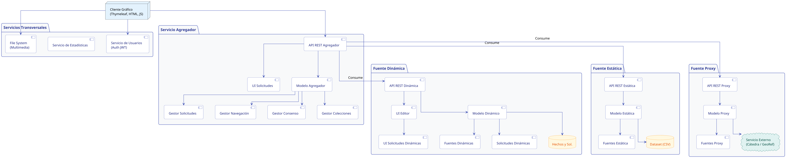
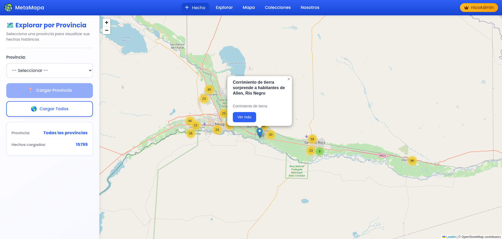
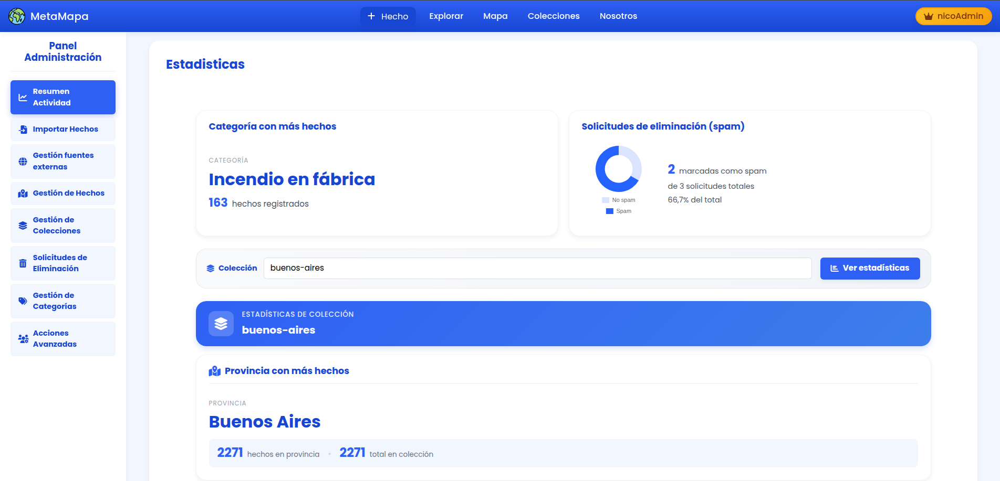

# MetaMapa

**Facultad**: Universidad Tecnológica Nacional (UTN) - Facultad Regional Buenos Aires (FRBA)  
**Materia**: Diseño de Sistemas de Información  
**Año**: 2025  
**Profesor**: Escobar, Ezequiel Oscar

### 👥 Integrantes
* De Goñi, Lucio — [@luciodegoni](https://github.com/luciodegoni)
* Jubilla, Ignacio Martín — [@Ignacio-Jubilla](https://github.com/Ignacio-Jubilla)
* Pinto Irigoyen, Gonzalo — [@GonzaloPintoIrigoyen](https://github.com/GonzaloPintoIrigoyen)
* Scatolon, Nicolás Martín — [@nicoScatolon](https://github.com/nicoScatolon)
* Vila, Ignacio Tomás — [@IgnacioTVila](https://github.com/IgnacioTVila)

---

## 1. Introducción
**Metamapa** es un centro de almacenamiento, procesamiento y distribución de **hechos** que ocurren en el país. Funciona como un portal de noticias nacional colaborativo, donde cualquier usuario puede aportar información que posteriormente es validada por un equipo de moderación.

El core del sistema radica en su capacidad de ingestar datos desde tres orígenes distintos y normalizarlos para que el sistema los consuma y visualice de manera uniforme:

* **Fuentes Estáticas**: Archivos estáticos (ej. CSV) cargados por moderadores. El sistema los procesa y transforma en información útil.
* **Fuentes Dinámicas**: El motor principal de la plataforma. Los usuarios identificados cargan hechos detallados (ubicación, fecha, multimedia). Requieren revisión manual (aceptación, rechazo o sugerencia de cambios).
* **Fuentes Proxy**: Integración con APIs de servicios externos que proveen hechos en tiempo real. Al no ser de nuestra propiedad, no se persisten en nuestra base de datos, sino que se consultan bajo demanda.

## 2. Arquitectura y Servicios

El ecosistema de Metamapa está compuesto por una arquitectura distribuida en los siguientes servicios clave:

* **Servicio de Agregación**: Motor principal que solicita periódicamente los hechos a las distintas fuentes (Estática, Dinámica, Proxy) y los normaliza bajo una misma estructura de datos.
* **Servicio de Usuarios**: Gestiona el ciclo de vida de las identidades (creación, modificación, validación). Su rol es fundamental ya que la arquitectura de la aplicación es **stateless** (sin estado), por lo que este servicio se encarga de emitir los *JWT (JSON Web Tokens)* necesarios para la autenticación en cada petición.
* **File System**: Responsable de persistir y organizar los archivos físicos. Almacena desde los CSV de las fuentes estáticas hasta el contenido multimedia (fotos, videos, audios, documentos), exponiendo URLs públicas para su acceso.
* **Servicio de Estadísticas**: Procesa grandes volúmenes de datos transaccionales para analizar el comportamiento de los usuarios y el rendimiento del sistema.
* **Cliente Gráfico (Frontend)**: Interfaz de usuario "liviana" sin lógica de negocio compleja, limitándose a renderizar los datos expuestos por las APIs.

---

## 3. Stack Tecnológico

Para el desarrollo de la plataforma, nos apoyamos en un ecosistema robusto basado en las siguientes herramientas y tecnologías:

**Frontend & Visualización**
* **Lenguajes**: HTML, CSS y JavaScript.
* **Cliente Gráfico (Motor de Plantillas)**: Thymeleaf (renderizado del lado del servidor).
* **Mapas**: Leaflet (para la visualización de geolocalización y widgets interactivos).

**Backend & Core**
* **Lenguaje & Framework**: Java 17 con Spring Boot.
* **Gestor de Dependencias**: Maven.
* **Dominio y Mapeo**: Jakarta EE (para adaptar el dominio y validaciones).
* **Reducción de Boilerplate**: Lombok (para simplificar clases mediante anotaciones).

**Persistencia de Datos**
* **Base de Datos**: MySQL.
* **Repositorios**: JpaRepository de Spring Data (para la abstracción del acceso a datos).

**Infraestructura, Seguridad y Externos**

* **Seguridad (Arquitectura Stateless)**: Al diseñar los servicios RESTful como *stateless* (el servidor no guarda sesiones en memoria), utilizamos **JWT (JSON Web Tokens)**. Esto permite que el cliente almacene el token y lo envíe en las cookies (o cabeceras) de cada solicitud, validando su identidad y permisos de manera eficiente y escalable sin cargar el servidor.
* **Geocodificación**: API de GeoRef (para normalizar y autocompletar ubicaciones).
* **Despliegue**: Dokploy (para la orquestación y puesta en producción del proyecto).
* **Monitoreo**: Datadog (para la observabilidad y supervisión de la salud del sistema).

---

## 4. Experiencia del Usuario

### 4.1. Navegación y Exploración
* **Landing Page**: Muestra una selección curada de hechos y colecciones destacadas por la administración.
* **Explorar Hechos**: Grilla con todos los hechos activos (los eliminados sufren un *soft-delete* y quedan ocultos).
    * **Filtros Avanzados**: Gracias a la estricta normalización, los usuarios pueden filtrar por Provincia, Categoría, Etiquetas, Fecha (carga/ocurrencia) y Fuente.
* **Modos de Navegación en Colecciones**:
    * *Irrestricta*: Se muestran todos los hechos obtenidos de las fuentes de la colección, sin curación adicional.
    * *Curada*: Se aplica un algoritmo de consenso (ver sección 5), añadiendo una capa extra de veracidad.

### 4.2. Gestión de Hechos (Creación y Detalle)
Solamente los **usuarios identificados** pueden aportar información al mapa.

* **Creación**: Se requiere título, fecha de ocurrencia, descripción, y categoría (existente o nueva).
    * **Geolocalización**: Carga manual (Provincia, Localidad, Calle, Número) o mediante un widget de mapa interactivo (Latitud/Longitud). Se integra con la API de **GeoRef** para completar datos faltantes.
    * **Multimedia**: Soporte para audio (MP3, WAV), video (MP4, AVI, MOV), imágenes (JPG, PNG, GIF) y documentos (PDF, DOC/X). La primera imagen cargada se asigna automáticamente como portada.
    * **Privacidad**: Opción de publicar como "Anónimo" (oculta la identidad al público, pero visible para moderadores).
* **Vista de Detalle**: Muestra toda la metadata del hecho, galería multimedia, mapa de ubicación y creador. Permite al autor editar el hecho dentro de los primeros 7 días (sujeto a nueva revisión).

### 4.3. El Mapa Interactivo

**Desafíos de Performance y Optimizaciones:**
Debido al alto volumen de datos, la renderización inicial del mapa presentaba cuellos de botella. Implementamos las siguientes soluciones:
1.  **Optimización de Queries**: Se creó un endpoint específico en el Agregador que proyecta únicamente los atributos estrictamente necesarios para el mapa (ID, título, lat/long), en lugar de traer los DTOs completos.
2.  **Caché en Cliente**: El frontend almacena la respuesta de las peticiones iniciales con un TTL (Time To Live) de 30 minutos para evitar saturar el backend.
3.  **Renderizado Diferido por Provincia**: En primera instancia, el mapa fuerza al usuario a hacer zoom sobre una provincia específica para cargar esos pines, evitando el colapso del navegador. La carga total nacional se deja bajo riesgo y petición explícita del usuario.
    *(Nota: Se analizó implementar Lazy Loading espacial / Bounding Box, pero se descartó por tiempos de desarrollo).*

### 4.4. Perfil y Participación
* **Mi Perfil / Registro**: Alta de usuarios (sin restricción de edad) y gestión de credenciales. Login disponible por email o *username*.
* **Mis Hechos**: Panel de seguimiento para ver el estado de los aportes (Aceptado, Pendiente, Rechazado, En Revisión, o con sugerencias).
* **Mis Solicitudes**: Seguimiento de los reportes de eliminación emitidos por el usuario.

---

## 5. Moderación y Consenso
El sistema requiere mecanismos robustos para asegurar la calidad de la información.

### 5.1. Solicitudes de Eliminación
Cualquier usuario puede reportar hechos erróneos o falsos.
* **Usuarios No Identificados**: Requieren una justificación obligatoria de al menos 500 caracteres.
* **Usuarios Identificados**: Sin restricciones de longitud.
* **Gestor de SPAM**: Un algoritmo evalúa las solicitudes entrantes para filtrar reportes basura y aligerar la carga de los moderadores. Si una solicitud se acepta, el hecho se da de baja (y se rechazan automáticamente otros reportes pendientes sobre el mismo).

### 5.2. Algoritmos de Consenso

Utilizados en las "Colecciones Curadas" para cruzar información de distintas fuentes y determinar si un hecho es veraz. Actualmente se compara por *Título*, configurable desde las *properties* del sistema:
* **Ninguno**: Pasan todos los hechos.
* **Absoluto**: El hecho debe estar presente exactamente en *todas* las fuentes consultadas.
* **Mayoría Simple**: El hecho debe existir en al menos el 50% de las fuentes.
* **Múltiple Mención**: Al menos dos fuentes deben contener el hecho, garantizando que no existan contradicciones (mismo título pero atributos drásticamente diferentes) en el resto de las fuentes.

---

## 6. Panel de Administración

Acceso restringido a roles `ADMIN` y `SUPER_ADMIN`.
* **Estadísticas**: Métricas globales (ej. provincia con más actividad, ratio de spam en solicitudes, categorías populares).
* **Gestión de Hechos (Dinámicos)**: Inbox de moderación. Aceptar, rechazar o devolver con sugerencias los hechos cargados por la comunidad.
* **Gestión de Fuentes**:
    * *Estática*: Interfaz para importar archivos CSV directamente a la base de datos y al File System.
    * *Externa (Proxy)*: Configuración de los endpoints de APIs de terceros (por defecto, la API de la cátedra).
* **Gestión de Colecciones y Categorías**: Creación de colecciones (definiendo criterios de filtrado y algoritmos de consenso). ABM de categorías y gestión de **Equivalencias** (ej. "lluvia" = "llovizna" para unificar resultados de búsqueda).
* **Acciones Avanzadas (Super Admin)**: Operaciones pesadas reservadas para horarios de bajo tráfico. Incluye alta de nuevos administradores, forzar la curación manual de colecciones, actualización en caliente de fuentes y limpieza de métricas obsoletas.

---

## 7. Demostración y Despliegue

Para ilustrar de forma práctica el funcionamiento y la puesta en producción de Metamapa, adjuntamos los siguientes videos demostrativos:

* 🎥 [**Recorrido por la Plataforma (Walkthrough)**](LINK_AL_VIDEO_1): Muestra de toda la página interactuando con el mapa, la carga de hechos y el panel de administración.
* 🛠️ [**Explicación del Despliegue (Deployment)**](https://youtu.be/HmwNubMAsCE?si=fM3cnXSJazv8fG5t): Detalle sobre la infraestructura, orquestación y cómo se llevó el sistema a producción. Video Presentado en la cursada.

---

## 8. Feedback y Retrospectiva

### 8.1. Devoluciones de la Cátedra (Entrega Final)
* **UX/UI**: Faltan notificaciones *toast* o modales de confirmación/éxito al realizar acciones (ej. crear un hecho).
* **Claridad**: Mejorar la visualización de los filtros activos en las búsquedas y pulir la estética de la vista de "Detalle de Hecho".
* **Usabilidad**: La diferencia entre navegación *irrestricta* y *curada* está oculta en la interfaz y resulta confusa para el usuario final.

### 8.2. Mejoras a Futuro (Deuda Técnica)
* Implementar un sistema global de alertas y *feedback* visual.
* Revisar y refactorizar el manejo del asincronismo en el frontend.
* Estabilizar la ingesta y actualización de datos desde las fuentes externas.
* Pulir los pipelines de despliegue para evitar errores en producción.
* *Nota del equipo:* Varias decisiones arquitectónicas iniciales quedaron rígidas. Dada la restricción de tiempo típica del año lectivo, se priorizó la entrega funcional sobre la refactorización profunda.